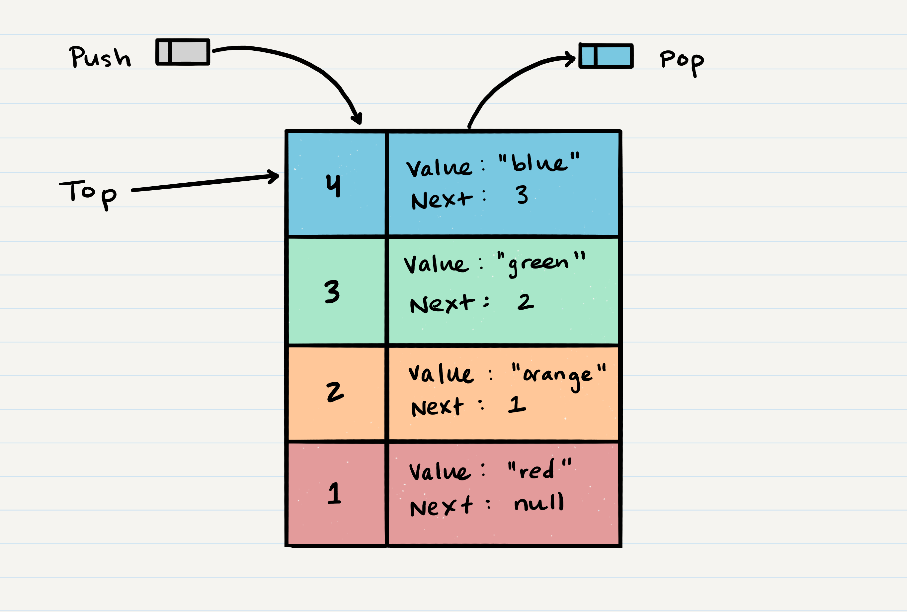

# Data Structures and Algorithms

## Language: `Python`

### Folder and Challenge Setup

Each type of code challenge has slightly different instructions. Please refer to the notes and examples below for instructions for each DS&A assignment type.

### Data Structure: New Implementation

-   Create a new folder under the `python` level, with the name of the data structure and complete your implementation there
    -   i.e. `linked_list`
-   Implementation (the data structure "class")

    -   The implementation of the data structure should match package name
        -   i.e. `linked_list/linked_list.py`
    -   Follow Python [naming conventions](https://www.python.org/dev/peps/pep-0008/#naming-conventions)

        ```python
        class LinkedList:
          def __init__(self):
            # ... initialization code

          def method_name(self):
            # method body
        ```

-   Tests
    -   Within folder `tests` create a test file called `test_[data_structure].py`
        -   i.e. `tests/test_linked_list.py`
        -   Your tests will then need to require the data structure you're testing
            -   i.e. `from linked_list.linked_list import LinkedList`

### Data Structure: Extending an implementation

-   Work within the existing data structure implementation
-   Create a new method within the class that solves the code challenge
    -   Remember, you'll have access to `self` within your class methods
-   Tests
    -   You will have folder named `tests` and within it, a test file called `test_[data_structure].py`
        -   i.e. `tests/test_linked_list.py`
        -   Add to the tests written for this data structure to cover your new method(s)

### Code Challenge / Algorithm

Code challenges should be completed within a folder named `code_challenges` under the `python` level

-   Daily Setup:
    -   Create a new folder under the `python` level, with the name of the code challenge
        -   Each code challenge assignment identifies the branch name to use, for example 'find-maximum-value'
        -   For clarity, create your folder with the same name, ensuring that it's `snake_cased`
        -   i.e. For a challenge named 'find_maximum_value', create the folder:`code_challenges/find_maximum_value`
    -   Code Challenge Implementation
        -   Each code challenge requires a function be written, for example "find maximum value"
        -   Name the actual challenge file with the name of the challenge, in `snake_case`
            -   i.e. `find_maximum_value.py`
        -   Reminder: Your challenge file will then need to require the data structure you're using to implement
            -   i.e. `from linked_list.linked_list import LinkedList`
        -   Your challenge function name is up to you, but name something sensible that communicates the function's purpose. Obvious is better than clever
            -   i.e. `find_maximum_value(linked_list)`
    -   Tests
        -   Ensure there is a `tests` folder at the root of project.
            -   i.e. a sibling of this document.
        -   within it, a test file called `test_[challenge].py`
            -   i.e. `tests/find_maximum_value.py`
            -   Your test file would require the challenge file found in the directory above, which has your exported function
                -   i.e. `from code_challenges.find_maximum_value import find_maximum_value`

## Running Tests

If you setup your folders according to the above guidelines, running tests becomes a matter of deciding which tests you want to execute. Jest does a good job at finding the test files that match what you specify in the test command

From the root of the `data-structures-and-algorithms/python` folder, execute the following commands:

-   **Run every possible test** - `pytest`
-   **Run filtered tests** - `pytest -k some_filter_text`
-   **Run in watch mode** - `ptw` or `pytest-watch`

# Table of Contents

## Reverse an Array

Return an array in reverse order

### Challenge

Write a function called `reverseArray` which takes an array as an argument. Without utilizing any of the built-in methods available to your language, return an array with elements in reversed order.

### Approach & Efficiency

Splice the array (array[::-1])
Time complexity: O(n), splice loops through the original area to get values
Space complexity:0(n), splice creates a new array which we will return

### Solution


## Shift an array

Insert a number at the midpoint of the array

### Challenge

Write a function called `insertShiftArray` which takes in an array and the value to be added. Without utilizing any of the built-in methods available to your language, return an array with the new value added at the middle index.

### Approach & Efficiency

Divide the length of the array by 2 and use insert() method to insert the number at the midpoint of the array

Time complexity: O(n), insert partially loops through the original to shift values
Space complexity:0(n), insert adds a values to the exsisting array

### Solution


## Array Binary Search

Find the key in a sorted array by binary search

### Challenge

Write a function called `BinarySearch` which takes in 2 parameters: a sorted array and the search key. Without utilizing any of the built-in methods available to your language, return the index of the array’s element that is equal to the search key, or -1 if the element does not exist.

### Approach & Efficiency

use a while loop and if else statements to split the array into sections based on high or low till the value is found and returned

Time complexity: O(n), using a while loop
Space complexity:0(1), not creating any extra data structures

### Solution


## Singly Linked Lists Implementation

Creating Node and LinkedList Classes

### Challenge

-   Create a Node class that has properties for the value stored in the Node, and a pointer to the next Node.
-   Within your LinkedList class, include a head property. Upon instantiation, an empty Linked List should be created.

    -   Define a method called `insert` which takes any value as an argument and adds a new node with that value to the `head` of the list with an O(1) Time performance.
    -   Define a method called `includes` which takes any value as an argument and returns a boolean result depending on whether that value exists as a Node’s value somewhere within the list.
    -   Define a method called `toString` (or `__str__` in Python) which takes in no arguments and returns a string representing all the values in the Linked List, formatted as:
        -   `"{ a } -> { b } -> { c } -> NULL"`

-   Any exceptions or errors that come from your code should be semantic, capturable errors. For example, rather than a default error thrown by your language, your code should raise/throw a custom, semantic error that describes what went wrong in calling the methods you wrote for this lab.
-   Be sure to follow your language/frameworks standard naming conventions (e.g. C# uses PascalCasing for all method and class names).

### Structure and Testing

Write tests to prove the following functionality

1. Can successfully instantiate an empty linked list
2. Can properly insert into the linked list
3. The head property will properly point to the first node in the linked list
4. Can properly insert multiple nodes into the linked list
5. Will return true when finding a value within the linked list that exists
6. Will return false when searching for a value in the linked list that does not exist
7. Can properly return a collection of all the values that exist in the linked list

## Approach & Efficency

I used while loops to search for values in a linked list. Big O time - O(n) because of the while loop. It is directly perportional to length of the Linked list
Big O space - O(1) because i am not creatign any new data structures just assessing what is already there

## API

Linked List methods:

1. **init** : upon instantiating a linked list the init method will assign head to the node that was passed into the class initiator. If no value is passed in None will be assigned and an empty Linked List will be created.
2. **str**: this will return a readable output of the linked lists values when the link list is printed
3. insert: this method will insert a node a the front of the linked list (will become the new head)
4. includes: this method will return true if a value is found in a linked list. It will return false if the value is not found
5. create_collection: this method will return a list of all the values found in the linked list.

## CC-6: Link List - Append,Insert before, Insert After

Write methods that appends an node to the end of the link list, inserts a new node before a specific value and one that inserts a new node after a specific value.

### Challenge

-   `.append(value)` which adds a new node with the given `value` to the end of the list
-   `.insertBefore(value, newVal)` which add a new node with the given `newValue` immediately before the first `value` node
-   `.insertAfter(value, newVal)` which add a new node with the given newValue immediately after the first value node

### Approach & Efficiency

Use while loops to traverse through the link list till position is found to insert the new link list

Time complexity: O(n), linear. The larger the linked list the more time it will take to traverse it
Space complexity: 0(1), we are not creating any new data structures

### Solution


## CC-7: Link List - kth from the end

Write a method that return the value of a node kth from the end of the linked list.

### Challenge

Write a method for the Linked List class which takes a number, `k`, as a parameter. Return the node’s value that is `k` from the end of the linked list. You have access to the Node class and all the properties on the Linked List class as well as the methods created in previous challenges.

### Approach & Efficiency

Created a length property in the linked list class that keeps track of the length of the linked list. I use that to fid out the position of the node kth from the end.

Time complexity: O(n), linear. The larger the linked list the more time it will take to traverse it
Space complexity: 0(1), we are not creating any new data structures

### Solution


## CC-8: Link List - Zip

Zip two Linked Lists

### Challenge

Write a function called `zipLists` which takes two linked lists as arguments. Zip the two linked lists together into one so that the nodes alternate between the two lists and return a reference to the head of the zipped list. Try and keep additional space down to O(1). You have access to the Node class and all the properties on the Linked List class as well as the methods created in previous challenges.

### Approach & Efficiency

Iterated through both linked lists and used the inster_after method to add link list to nodes into link list 1

Time complexity: O(n), linear. The larger the linked lists the more time it will take to traverse it
Space complexity: 0(1), we are not creating any new data structures

### Solution


## CC-10: Stacks And Queues Implementation

Create Classes for Stacks and Queues

### Challenge

-   Create a `Node` class that has properties for the value stored in the Node, and a pointer to the next node.
-   Create a `Stack` class that has a top property. It creates an empty Stack when instantiated.
    -   This object should be aware of a default empty value assigned to `top` when the stack is created.
    -   Define a method called `push` which takes any value as an argument and adds a new node with that value to the `top` of the stack with an O(1) Time performance.
    -   Define a method called `pop` that does not take any argument, removes the node from the top of the stack, and returns the node’s value.
        -   Should raise exception when called on empty stack
    -   Define a method called `peek` that does not take an argument and returns the value of the node located on top of the stack, without removing it from the stack.
        -   Should raise exception when called on empty stack
    -   Define a method called `isEmpty` that takes no argument, and returns a boolean indicating whether or not the stack is empty.
-   Create a `Queue` class that has a `front` property. It creates an empty Queue when instantiated.
    -   This object should be aware of a default empty value assigned to `front` when the queue is created.
    -   Define a method called `enqueue` which takes any value as an argument and adds a new node with that value to the back of the queue with an O(1) Time performance.
    -   Define a method called `dequeue` that does not take any argument, removes the node from the front of the queue, and returns the node’s value.
    -   Should raise exception when called on empty queue
    -   Define a method called `peek` that does not take an argument and returns the value of the node located in the front of the queue, without removing it from the queue.
        -   Should raise exception when called on empty queue
    -   Define a method called `isEmpty` that takes no argument, and returns a boolean indicating whether or not the queue is empty.

### Testing

Write tests to prove the following functionality:

1. Can successfully push onto a stack
2. Can successfully push multiple values onto a stack
3. Can successfully pop off the stack
4. Can successfully empty a stack after multiple pops
5. Can successfully peek the next item on the stack
6. Can successfully instantiate an empty stack
7. Calling pop or peek on empty stack raises exception
8. Can successfully enqueue into a queue
9. Can successfully enqueue multiple values into a queue
10. Can successfully dequeue out of a queue the 11. expected value
11. Can successfully peek into a queue, seeing the expected value
12. Can successfully empty a queue after multiple dequeues
13. Can successfully instantiate an empty queue
    Calling dequeue or peek on empty queue raises exception

### Time Complexities

Stacks:

-   push: O(1)
-   pop: O(1)
-   peek: O(1)
-   isEmpty: O(1)

Queues:

-   enqueue: O(1)
-   dequeue: O(1)
-   peek: O(1)
-   isEmpty: O(1)

### Solution




## CC-11: Queues with Stacks

Implement a Queue using two Stacks.

### Challenge

Create a brand new `PseudoQueue` class. Do not use an existing Queue. Instead, this PseudoQueue class will implement our standard queue interface (the two methods listed below), but will internally only utilize 2 `Stack` objects. Ensure that you create your class with the following methods:

-   `enqueue(value)` which inserts `value` into the PseudoQueue, using a first-in, first-out approach.
-   `dequeue()` which extracts a value from the PseudoQueue, using a first-in, first-out approach.
-   The Stack instances have only `push`, `pop`, and `peek` methods. You should use your own Stack implementation. Instantiate these Stack objects in your PseudoQueue constructor.

### Time Complexities

PseudoQueue:

-   enqueue: O(n) Time / O(1) Space
-   dequeue: O(n) Time / O(1) Space

### Solution


## CC-12: Queues with Animal Shelter

First-in, First out Animal Shelter.

### Challenge

-   Create a class called AnimalShelter which holds only dogs and cats. The shelter operates using a first-in, first-out approach.
-   Implement the following methods:
    -   `enqueue(animal)`: adds `animal` to the shelter. `animal` can be either a dog or a cat object.
    -   `dequeue(pref)`: returns either a dog or a cat. If `pref` is not `"dog"` or `"cat"` then return null.

### Time Complexities

PseudoQueue:

-   enqueue: O(1) Time / O(1) Space
-   dequeue: O(1) Time / O(1) Space

### Solution


## CC-13: Multi-bracket Validation

Multi-bracket Validation.

### Challenge

Your function should take a string as its only argument, and should return a boolean representing whether or not the brackets in the string are balanced. There are 3 types of brackets:

-   Round Brackets : ()
-   Square Brackets : []
-   Curly Brackets : {}

### Approach & Efficiency

Iterated through the str using a dictionary to keep track of of the barckets and how many times they show up.

### Time Complexities

-   Time: O(n) , linear. The larger str the more time it will take to iterate through it
-   Space: O(n), created a dictionary to keep track of the brackets

### Solution


## CC-15: Binary Tree and BST Implementation

Create Classes for Binary Tree and BST

### Challenge

-   Create a Node class that has properties for the value stored in the node, the left child node, and the right child node.
-   Create a BinaryTree class
-   Define a method for each of the depth first traversals called preOrder, inOrder, and postOrder which returns an array of the values, ordered appropriately.

-   Any exceptions or errors that come from your code should be semantic, capturable errors. For example, rather than a default error thrown by your language, your code should raise/throw a custom, semantic error that describes what went wrong in calling the methods you wrote for this lab.

-   Create a BinarySearchTree class
-   Define a method named add that accepts a value, and adds a new node with that value in the correct location in the binary search tree.
-   Define a method named contains that accepts a value, and returns a boolean indicating whether or not the value is in the tree at least once.-

### Structure & Testing

Utilize the Single-responsibility principle: any methods you write should be clean, reusable, abstract component parts to the whole challenge. You will be given feedback and marked down if you attempt to define a large, complex algorithm in one function definition.

Write tests to prove the following functionality:

1. Can successfully instantiate an empty tree
2. Can successfully instantiate a tree with a single root node
3. Can successfully add a left child and right child to a single root node
4. Can successfully return a collection from a preorder traversal
5. Can successfully return a collection from an inorder traversal
6. Can successfully return a collection from a postorder traversal queue

### Time Complexities

BST:

-   in a balanced tree = O(log n)
-   unbalanced tree = O(n)

### Example of BST


## CC-16: Maximum Value in a Binary Tree

Find the Maximum Value in a Binary Tree

### Challenge

Write an instance method called `find-maximum-value`. Without utilizing any of the built-in methods available to your language, return the maximum value stored in the tree. You can assume that the values stored in the Binary Tree will be numeric.

### Approach & Efficiency

Traverse the whole tree while comparing values to variable holding the current max. After the whole tree has been traversed and values assessed, the function will return the current max variable.

Time complexity: O(log n)
Space complexity: 0(1)

### Solution


## CC-17: Maximum Value in a Binary Tree

Find the Maximum Value in a Binary Tree

### Challenge

Write a breadth first traversal method which takes a Binary Tree as its unique input. Without utilizing any of the built-in methods available to your language, traverse the input tree using a Breadth-first approach, and return a list of the values in the tree in the order they were encountered.

### Approach & Efficiency

Traverse the width of the tree using a Queue

Time complexity: O(log n)
Space complexity: 0(n)

### Solution


## CC-18: FizzBuzz Tree

Conduct “FizzBuzz” on a k-ary tree while traversing through it to create a new tree.

### Challenge

-   Write a function called FizzBuzzTree which takes a k-ary tree as an argument.
-   Without utilizing any of the built-in methods available to your language, determine whether or not the value of each node is divisible by 3, 5 or both. Create a new tree with the same structure as the original, but the values modified as follows:
    -   If the value is divisible by 3, replace the value with “Fizz”
    -   If the value is divisible by 5, replace the value with “Buzz”
    -   If the value is divisible by 3 and 5, replace the value with “FizzBuzz”
    -   If the value is not divisible by 3 or 5, simply turn the number into a String.

### Approach & Efficiency

Traverse the recursively while looping through child array

Time complexity: O(log n)
Space complexity: 0(n)

### Solution


## CC-26: Insertion Sort

Link to [Blog](./code_challenges/insertion_sort/BLOG.md) post

Review the pseudocode below, then trace the algorithm by stepping through the process with the provided sample array. Document your explanation by creating a blog article that shows the step-by-step output after each iteration through some sort of visual.

### Approach & Efficiency

Time complexity: O(n^2)
Space complexity: 0(1)

## CC-27: Merge Sort

Link to [Blog](./code_challenges/merge_sort/BLOG.md) post

Review the pseudocode below, then trace the algorithm by stepping through the process with the provided sample array. Document your explanation by creating a blog article that shows the step-by-step output after each iteration through some sort of visual.

### Approach & Efficiency

Time complexity: O(n log(n))
Space complexity: 0(n)

## CC-28: Quick Sort

Link to [Blog](./code_challenges/quick_sort/BLOG.md) post

Review the pseudocode below, then trace the algorithm by stepping through the process with the provided sample array. Document your explanation by creating a blog article that shows the step-by-step output after each iteration through some sort of visual.

### Approach & Efficiency

Time complexity: O(n^2)
Space complexity: 0(log n)
