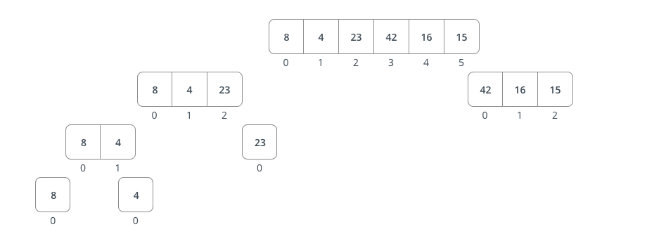
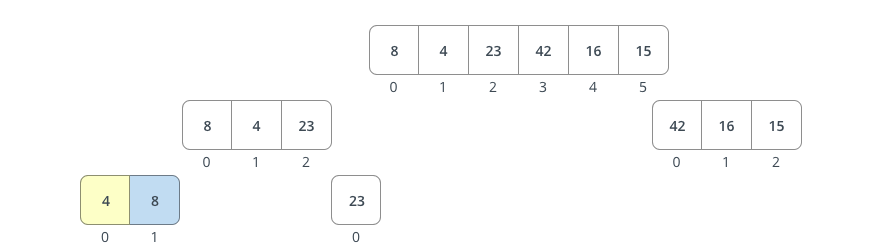
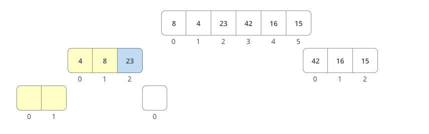
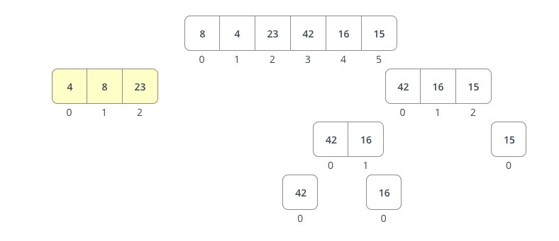
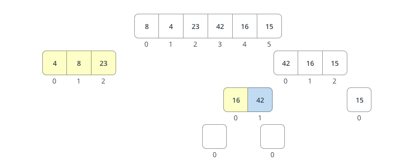
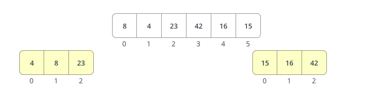
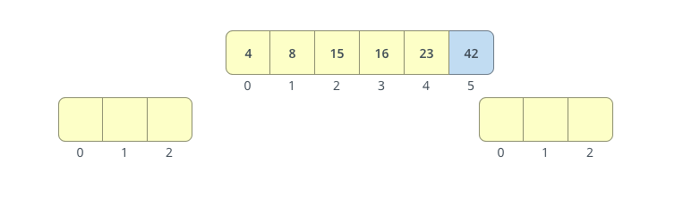

# Merge Sort

## Pseudocode

```
ALGORITHM Mergesort(arr)
    DECLARE n <-- arr.length

    if n > 1

      DECLARE mid <-- n/2
      DECLARE left <-- arr[0...mid]
      DECLARE right <-- arr[mid...n]

      Mergesort(left)

      Mergesort(right)

      Merge(left, right, arr)


ALGORITHM Merge(left, right, arr)
    DECLARE i <-- 0
    DECLARE j <-- 0
    DECLARE k <-- 0

    while i < left.length && j < right.length
        if left[i] <= right[j]
            arr[k] <-- left[i]
            i <-- i + 1
        else
            arr[k] <-- right[j]
            j <-- j + 1

        k <-- k + 1

    if i = left.length
       set remaining entries in arr to remaining values in right
    else
       set remaining entries in arr to remaining values in left
```

So lets walk through this section by section. The comments are denoted by a //. The comments explain whats happening line by line.

```
ALGORITHM Mergesort(arr)
    // create a varaiable that stores the length of the array
    DECLARE n <-- arr.length

    // if the array is lesstahn or equal to one you dopnt need to sort it. If it is we enter this if block
    if n > 1
      //Split the array in half
      DECLARE mid <-- n/2
      //store the left side in a variable
      DECLARE left <-- arr[0...mid]
      //store the right side in a variable
      DECLARE right <-- arr[mid...n]
      // continue to split left side
      Mergesort(left)
      // continue to split left side
      Mergesort(right)
      // run the helper function to merge the multiple single index arrays
      Merge(left, right, arr)
```

Next group of code

```
//create a helper function that takes in a left split a right split and the array you are sorting
ALGORITHM Merge(left, right, arr)

    //assign 0 to variables named i, j and k
    DECLARE i <-- 0 //keeps track of index in left array
    DECLARE j <-- 0 //keeps track of index in right array
    DECLARE k <-- 0 //keeps track of list_to_sort index

    //create a while loop that only contiunes as long we have gone through the full length of either the left or right side array
    while i < left.length && j < right.length
        //if the number in the left array is greater than the number in the right array then place the number in the left array at the apporiate index
        if left[i] <= right[j]
            arr[k] <-- left[i]
            i <-- i + 1 //increment i
        else //else if the number in the right array is less than move it
            arr[k] <-- right[j]
            j <-- j + 1 //increment j

        k <-- k + 1 //increment k
```

The last section covers what we do when we have exhausted either the left or right array.

```
 //if we have sorted all number in the left array
 if i = left.length
       //sort the remainder of the right array numbers
       set remaining entries in arr to remaining values in right

 //if we have sorted all number in the right array
 else
       //sort the remainder of the left array numbers
       set remaining entries in arr to remaining values in left
```

## Walk through

Now that we have walked through what each line does lets take an unsorted list and look at what every loop looks like to sort it.

```Python
list_to_sort = [8,4,23,42,16,15]
```

### Before invoking merge function

So before we invoke the help function we have to split down the sort list first.
first we save the length of the array in a variable. Then we enter the if statement and start to split down the array. Check picture for visual.

```Python
n = len(list_to_sort) //6

if n > 1: (6 >2 TRUE)
        mid = n // 2 (mid == 3)
        left = list_to_sort[:mid] (left == [8,4,23])
        right = list_to_sort[mid:] (right == [42,16,15])

        sort_merge(left) //after recursively sorting we get ([8],[4],[23])

        sort_merge(right) //after recursively sorting we get ([42],[16],[15])

        return merge(left, right, list_to_sort)

    else:
        return list_to_sort
```














